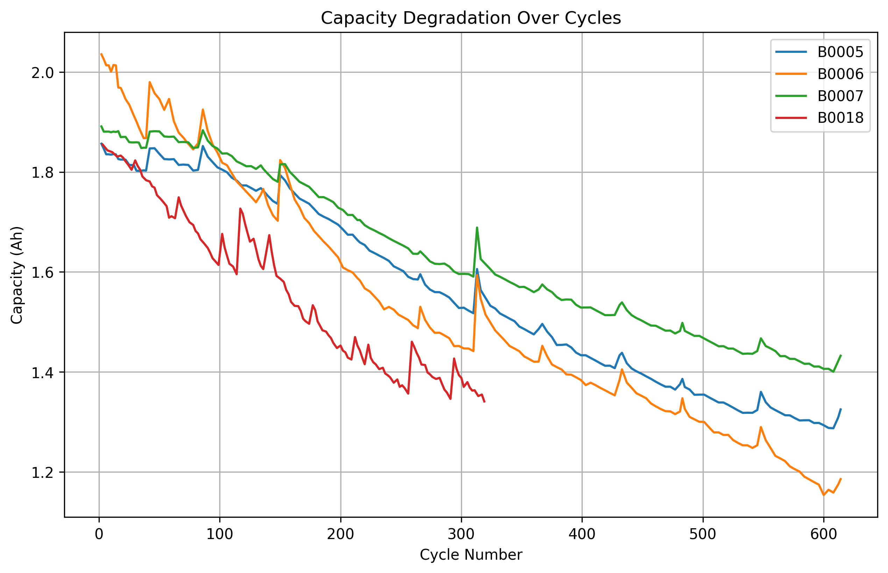
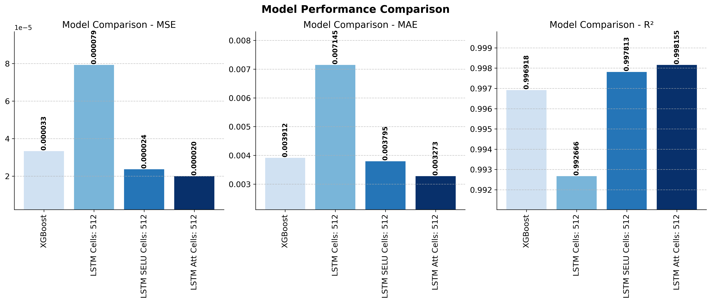
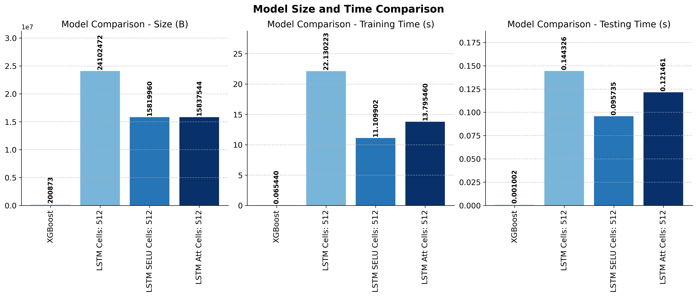
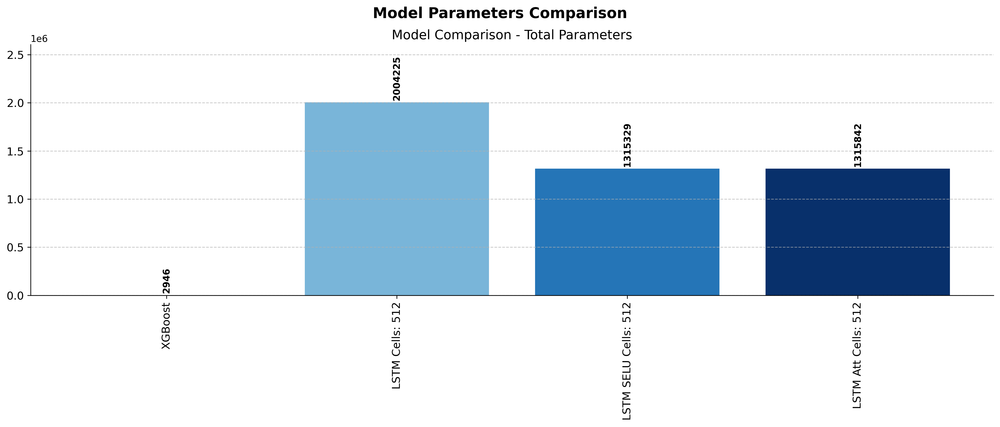
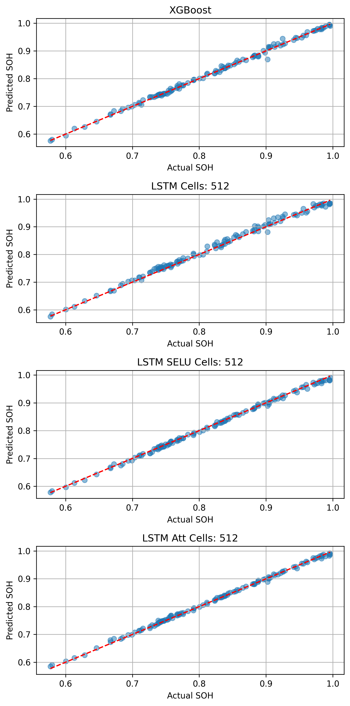

# LI_NASA

This project implements machine learning models to predict critical battery State of Health (SOH) using the National Space Agency (NASA) lithium-ion battery dataset.

## Project Overview

The project analyzes battery cycling data to predict degradation patterns and performance metrics using both deep learning Long Short-Term Memory (LSTM) and traditional machine learning Extreme Gradient Boosting (XGBoost) approaches. The implementation enables accurate estimation of battery health, which is crucial for battery management systems in various applications. The Scaled Exponential Linear Unit (SELU) activation function in a single layer was found to outperfrom the architecture with two LSTM layers using the Rectified Exponential Linear Unit (RELU) function, but both were less successful than the LSTM attention mechanism implementation.

## Dataset

The project uses NASA's battery dataset, which contains cycling data for lithium-ion batteries running to failure under different operational conditions. The dataset includes measurements such as voltage, current, temperature, and capacity for each charge-discharge cycle.

To obtain the dataset, follow the instructions in the [data/readme.md](data/readme.md) file.

## Project Structure

```
battery-prediction/
│
├── code/               # Python code
│   ├── battery_best_kfold_single.py            # Hyperparameter selection
│   ├── battery_data_analysis.py   # Data exploration and feature engineering
│   ├── battery_prediction_kfold_nested.py      # Model training and validation
│   └── battery_prediction_kfold_single.py      # Model training and testing
│
├── data/                    # Data directory
│   ├── NASA_batteries/      # NASA battery data set
│   ├── readme.md            # Instructions for downloading data
│   └── README.txt           # NASA data description
│
├── models/                  # Saved model files
│
├── utils/                   # Utility functions
│   ├── __init__.py
│   ├── data_loader.py       # Functions to load and preprocess data
│   └── plotting.py          # Visualization functions
│
├── readme.md                # Project documentation
└── requirements.txt         # Project dependencies
```

## Installation

1. Clone this repository:
   ```
   git clone https://github.com/LucijaZuzic/LI_NASA.git
   cd LI_NASA
   ```

2. Create and activate a virtual environment (optional but recommended):
   ```
   python -m venv venv
   source venv/bin/activate  # On Windows: venv\Scripts\activate
   ```

3. Install dependencies:
   ```
   pip install -r requirements.txt
   ```

4. Download the dataset following instructions in `data/readme.md`

## Usage

The project workflow is organized in four Python scripts:

1. **battery_data_analysis.py**:
   - Loads and preprocesses the NASA battery dataset
   - Performs exploratory data analysis
   - Extracts relevant features
   - Prepares data for model training

2. **battery_prediction_kfold_nested.py**:
   - Implements the models for SOH prediction
   - Nested 5-fold cross-validation
   - Visualizes validation results
   - Tune hyperparameters (number of cells)

3. **battery_prediction_kfold_single.py**:
   - Implements the models for SOH prediction
   - 5-fold cross-validation
   - Visualizes testing results
   - Determine the best model on each testing fold

2. **battery_best_kfold_single.py**:
   - Prints the concise results of SOH prediction
   - Prints the tuned hyperparameters
   - Visualizes filtered testing results
   - Prints the best model on each testing fold

To run the notebooks:
```
jupyter notebook notebooks/battery_data_analysis.ipynb
jupyter notebook notebooks/battery_prediction.ipynb
```

## Models

The project implements four different approaches for battery performance prediction:

1. **LSTM Network**: 
   - Deep learning approach for time-series analysis
   - Captures temporal patterns in battery degradation
   - Suitable for SOH prediction with sequential data

2. **XGBoost**:
   - Gradient boosting approach for tabular data
   - Feature-based prediction using statistical battery properties
   - Excellent performance with engineered features

3. **LSTM SELU Network**:
   - SELU is designed to automatically keep data stable and prevent common training problems
   - SELU uses an exponential curve for negative values to maintain a specific average output
   - SELU creates self-normalizing networks, eliminating the need for normalization layers
   - SELU prevents dying neurons by outputting non-zero values for negative inputs
   
4. **LSTM Network with Attention**: 
   - The attention mechanism isolates the most important time points
   - Better at describing complex sequences
   - Focuses only on significant parts of the input sequence

## Results

### Battery Capacity Degradation
The graph below shows the degradation trend of four battery units (B0005, B0006, B0007, B0018) across several cycles. As seen, the capacity decreases progressively as the number of cycles increases, which is typical of lithium-ion battery aging.



### Model Performance Comparison
Four models were evaluated for predicting battery state of health:
- **LSTM**
- **XGBoost**
- **LSTM SELU Network**
- **LSTM Network with Attention**

Performance metrics used:
- **Mean Squared Error (MSE)**
- **Mean Absolute Error (MAE)**
- **R² Score**

The bar plots below summarize the performance. LSTM Attention outperforms the other models in all metrics:



To asses computational demands, the following metrics are used:

- **Training time (s)**
- **Testing time (s)**
- **Model file size (B)**

The bar plots below summarize the findings. XGBoost outperforms the other models in all efficiency indicators:



To conclude the comparison of model sizes it is important to consider the:

- **Number of parameters**

The bar plots below summarize the findings. XGBoost has the lowest number of parameters:




### Model Prediction Analysis
The scatter plots compare predicted vs actual SOH values for the four models:

- **Top Row:** XGBoost Predictions
- **Second Row:** LSTM Predictions
- **Third Row:** LSTM SELU Predictions
- **Fourth Row:** LSTM with Attention Predictions

LSTM with attention predictions lie very close to the diagonal, indicating higher accuracy, while XGBoost predictions show a slightly larger deviation from the ideal line.



### 💡 Conclusion
- Battery capacity degrades steadily over cycling, with unit B0018 showing the steepest decline.
- LSTM with attention significantly outperforms XGBoost for SOH prediction in terms of error and fit.
- Predictive modeling is a strong tool for forecasting battery health and optimizing maintenance cycles.

## Dependencies

- Python 3.8+
- TensorFlow/Keras
- XGBoost
- Pandas/NumPy
- Matplotlib/Seaborn
- SciPy/Scikit-learn

## Acknowledgments

- NASA Prognostics Center of Excellence for providing the battery dataset
- B. Saha and K. Goebel (2007). "Battery Data Set", NASA Ames Prognostics Data Repository, NASA Ames Research Center, Moffett Field, CA.
- https://github.com/krithicswaroopan/Lithium-ion_battery_SOH_Prediction.git
- https://machinelearningmastery.com/adding-a-custom-attention-layer-to-recurrent-neural-network-in-keras/